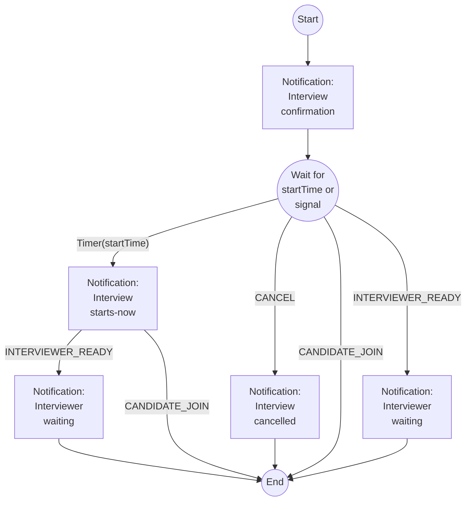

# Scheduled Interview Notification Worfklow Example

This code was originally based off Temporal's
[Hello World Tutorial](https://learn.temporal.io/getting_started/typescript/hello_world_in_typescript/).

That skeleton was modified to implement an example centered around notifications for
scheduled interviews. The workflow can be visualized with the following flowchart:



## Code organization

To understand this code base, first review
[A Practical Approach to Temporal Architecture](https://mikhail.io/2020/10/practical-approach-to-temporal-architecture/).

The main parts of this example map directly to the components described above:
- `temporal-server/`: Temporal Server, which you can treat as a black box (not commited
  to this repo, but is cloned as a prerequisite). You won't modify this code, and you
  won't even need it if you're using [Temporal Cloud](https://temporal.io/cloud).
- `src/workers.ts`: Temporal Worker, which is responsible for running the activities for
  your workflow.
- `src/client.ts`: Temporal Client, which is responsible for initiating and sending
  signals to workflows.
- `src/workflows.ts`: Temporal Workflows, which is the high-level business logic for
  your workflows.
- `src/activites.ts`: Temporal Activies, which is the business logic responsible for
  the actual work (e.g. talking to services).
- `src/app.ts` + `src/webapp/*`: Express app that uses Temporal Client to initiate
  workflows and send signals to workflows.
  - This app is also being used as a mock Notification Service. Typically, this would be
    completely separate service, but this app is reused for convenience.

## Running this example

### Prerequisites

Before getting started, you
- Clone the Temporal Server repo into this directory:
  ```sh
  git clone https://github.com/temporalio/docker-compose.git temporal-server`
  ```
- Install dependencies:
  ```sh
  npm install
  ```

### Starting servers

Running this sample requires 3 separate shells:
1. Server shell: `cd temporal-server/; docker-compose up` to start the Temporal Server
1. Worker shell: `./worker.sh` to start the Worker
1. Web App shell: `./app.sh` to run an Express app, that will interact with
   the Workflow Client.

You'll also want to fourth shell to interact with the Web App.

Note that the `worker.sh` and `app.sh` are simple wrappers around npm scripts to display
the script name in the shell title bar and easily distinguish the two shells.

### Starting and interacting with workflows

The following examples use [httpie](https://httpie.io/) (i.e. command `http`) to
interact with the Web App.

To make the examples easier to read, we'll define the following shell variables for the
webapp endpoints that interact with the workflow:
```sh
START=http://localhost:3000/workflows/interviews/start
UPDATE=http://localhost:3000/workflows/interviews/update
```

#### Basic workflow: Confirmation and starts-now notifications

As a simple example, lets have user "alice" start the interview notification workflow,
by hitting the Web App API:

```sh
http $START user=alice
```

##### Worker output

The worker is responsible for running through the notification workflow and making
requests to the "Notification Service". For the example above, the output looks like:
```sh
9:31:15 PM: alice - =========== Started workflow ===========
9:31:15 PM: alice - Sent interview scheduled confirmation
9:31:25 PM: alice - Sent interview starts now notification
9:31:35 PM: alice - ~~~~~~~~~~ Completed workflow ~~~~~~~~~~
```

Note that the 'starts now' message will take some time to display---currently defined in
workflow as a 10 second delay. The actual delay is typically around 12 seconds because
the workflow calls multiple `condition`s with the 10 second delay, and each condition
requires a roundtrip between Temporal Server and the Worker.

##### Web App output

For convenience, the "Notification Service" is actually the same Web App used to
interact with the Temporal Workflow, so the notification output can be seen in the app
shell:

```sh
From: "alice" <alice@test.com>
To: "Talent Attraction" <hiring@fake.org>
Date: Mon, 26 Dec 2022 20:45:08 GMT
Subject: Your interview is scheduled

...


From: "alice" <alice@test.com>
To: "Talent Attraction" <hiring@fake.org>
Date: Mon, 26 Dec 2022 20:45:18 GMT
Subject: Your interview starts now

...
```

In many of the following examples, the mock emails will be left out of the explanation,
but you should expect to see these mock emails in the app output.

#### Example workflow: Interviewer joins _after_ scheduled start time

If the interviewer joins _after_ the scheduled start time of the interview, we send an
additional nudge to prompt the candidate to join.

```sh
http $START user=alice
# Wait until after the starts-now notification before executing the following:
http $UPDATE user=alice signal=INTERVIEWER_READY
```

The worker will output should display something like the following:
```sh
9:33:45 PM: alice - =========== Started workflow ===========
9:33:45 PM: alice - Sent interview scheduled confirmation
9:33:55 PM: alice - Sent interview starts now notification
9:33:57 PM: alice - Sent interviewer waiting notification
9:33:57 PM: alice - ~~~~~~~~~~ Completed workflow ~~~~~~~~~~
```

#### Example workflow: Interviewer joins _before_ scheduled start time

If the interviewer joins _before_ the scheduled start time of the interview, we skip
the starts-now notification.

```sh
http $START user=alice
http $UPDATE user=alice signal=INTERVIEWER_READY
```

The worker will output should display something like the following:
```sh
9:37:19 PM: alice - =========== Started workflow ===========
9:37:19 PM: alice - Sent interview scheduled confirmation
9:37:21 PM: alice - Sent interviewer waiting notification
9:37:21 PM: alice - ~~~~~~~~~~ Completed workflow ~~~~~~~~~~
```

#### Example workflow: Candidate joins _before_ interviewer joins

If the candidate joins before the interviewer does (and before the scheduled start time),
we skip all follow up notifications.

```sh
http $START user=alice
http $UPDATE user=alice signal=CANDIDATE_JOIN
http $UPDATE user=alice signal=INTERVIEWER_READY
```

The worker will output should display something like the following:
```sh
9:39:18 PM: alice - =========== Started workflow ===========
9:39:18 PM: alice - Sent interview scheduled confirmation
9:39:18 PM: alice - Candidate joined interview
9:39:18 PM: alice - ~~~~~~~~~~ Completed workflow ~~~~~~~~~~
```

In the shell where we execute the requests, one of the responses will look similar to
the following:
```sh
HTTP/1.1 400 Bad Request
...

Workflow not found. Call `start` before `update`.
```
When the candidate joins, the workflow is ended, so subsequent calls have no effect.

#### Example workflow: Interview cancellation

Another common case is to schedule an interview and then cancel it:

```sh
http $START user=alice
http $UPDATE user=alice signal=CANCEL
```

The worker will output should display something like the following:
```sh
9:30:36 PM: alice - =========== Started workflow ===========
9:30:36 PM: alice - Sent interview scheduled confirmation
9:30:36 PM: alice - Sent interview cancellation notification
9:30:36 PM: alice - ~~~~~~~~~~ Completed workflow ~~~~~~~~~~
```

#### Simulating flaking services

One of the core capabilities of Temporal is to standardize and simplify retry logic. To
exercise this logic, you can run the app with `NOTIFICATION_SERVICE_FLAKINESS`:
```sh
NOTIFICATION_SERVICE_FLAKINESS=0.5 ./app.sh
```
The `0.5` here causes the notification service to return a 503 Service Unavailable error
about 50% of the time.

You can start the workflow like normal:
```sh
http $START user=alice
```

The following example shows the confirmation notification is sent normally, and then
there are multiple failed attempts to send the cancellation notification before finally
succeeding:
```sh
2:14:57 PM: alice - =========== Started workflow ===========
2:14:57 PM: alice - Sent interview scheduled confirmation
2022-12-27T20:15:07.785Z [WARN] Activity failed {
  ...
  attempt: 1,
  ...
}
2022-12-27T20:15:08.825Z [WARN] Activity failed {
  ...
  attempt: 2,
  ...
}
2022-12-27T20:15:10.854Z [WARN] Activity failed {
  ...
  attempt: 3,
  ...
}
2:15:14 PM: alice - Sent interview starts now notification
2:15:14 PM: alice - ~~~~~~~~~~ Completed workflow ~~~~~~~~~~
```
Note that the first failed send is about 10 seconds after the confirmation notification
(i.e. the pre-defined delay between scheduled and start). The first retry after that
failure happens less than a second later, and each subsequent attempt takes longer and
longer due to exponential backoff. See <https://docs.temporal.io/concepts/what-is-a-retry-policy>

The app server displays the notifications plus some logging for the 503 errors:
```sh
From: "alice" <alice@test.com>
To: "Talent Attraction" <hiring@fake.org>
Date: Tue, 27 Dec 2022 20:14:57 GMT
Subject: Your interview is scheduled

...

503: Service Unavailable
503: Service Unavailable
503: Service Unavailable

From: "alice" <alice@test.com>
To: "Talent Attraction" <hiring@fake.org>
Date: Tue, 27 Dec 2022 20:15:14 GMT
Subject: Your interview starts now

...

```

#### Simulating unavailable workers

To simulate what happens when workers are unavailable, we simply start the workflow:
```sh
http $START user=alice
```

And then after the workflow has started running, we can kill the worker (e.g. using
`Ctrl-c` in that terminal):
```sh
9:42:35 PM: alice - =========== Started workflow ===========
9:42:35 PM: alice - Sent interview scheduled confirmation
<kill signal>
2022-12-30T03:42:36.557Z [INFO] Worker state changed { state: 'STOPPING' }
...
2022-12-30T03:42:36.593Z [INFO] Worker state changed { state: 'STOPPED' }
```

After waiting a bit of time, we can restart the worker and see the execution continue
without issue:
```sh
$ ./worker.sh

2022-12-30T03:43:00.758Z [INFO] Creating worker {
...
2022-12-30T03:43:01.406Z [INFO] Worker state changed { state: 'RUNNING' }
9:43:01 PM: alice - Sent interview starts now notification
9:43:01 PM: alice - ~~~~~~~~~~ Completed workflow ~~~~~~~~~~
```
